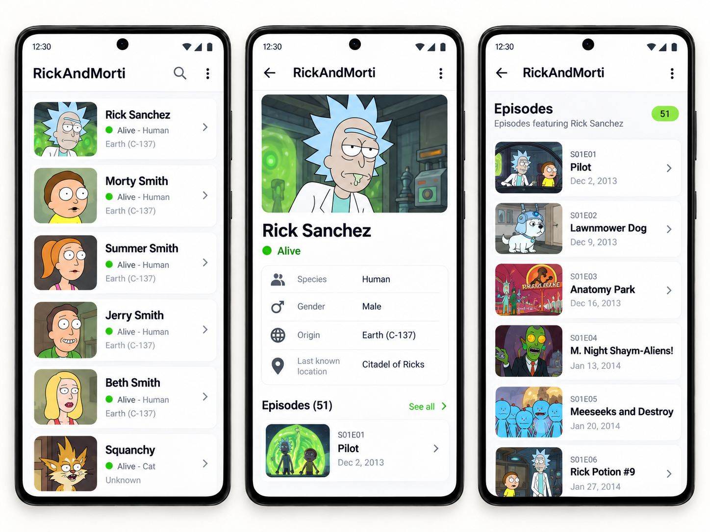

# RickAndMorti

Android-приложение для просмотра персонажей вселенной Rick and Morty с получением данных через REST API.

Проект реализован на Kotlin и демонстрирует работу с сетевыми запросами, ViewModel, LiveData, dependency injection и отображением данных из внешнего API.

## Screenshots

<p align="center">
  
</p>

## Features

- загрузка персонажей через REST API
- отображение списка персонажей
- изображения персонажей
- отображение имени персонажа
- отображение статуса персонажа
- отображение вида персонажа
- переход к детальной информации
- отображение информации о выбранном персонаже
- обработка сетевых данных
- dependency injection
- загрузка изображений из сети

## Tech Stack

- Kotlin
- Android SDK
- XML
- Retrofit
- OkHttp
- Gson
- Hilt
- ViewModel
- LiveData
- ViewBinding
- Glide
- RecyclerView

## Architecture

Приложение разделяет отображение данных и работу с данными с использованием Android Architecture Components.

ViewModel и LiveData используются для управления состоянием UI.

Hilt используется для dependency injection.

Retrofit и OkHttp используются для получения данных из REST API.

Glide используется для загрузки изображений персонажей.

## Main Screens

- Characters — список персонажей Rick and Morty
- Character Details — подробная информация о выбранном персонаже

## Project Structure

```text
app/
├── data/
├── di/
├── ui/
├── utils/
│   ├── CharacterActivity
│   └── DetailsActivity
├── App
└── resources/
